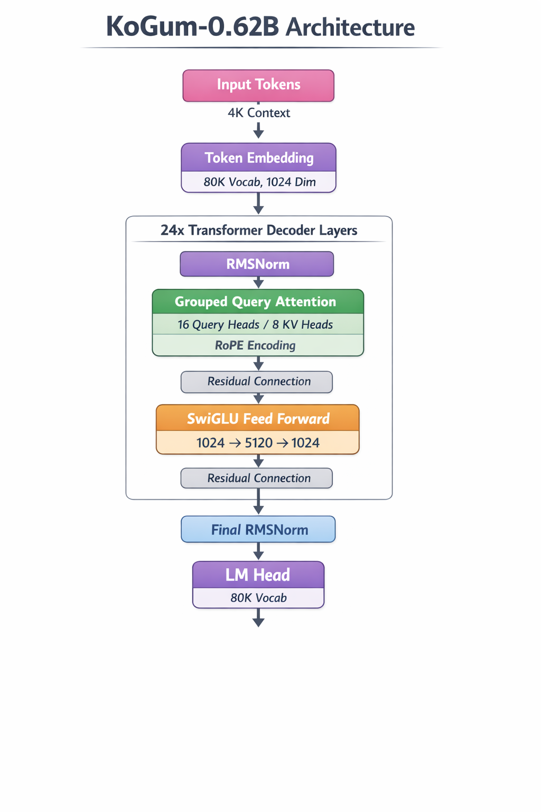

# KoGum (Korean Gulliver Model)

한국어 중심의 소규모 고성능 언어 모델입니다.

## 모델 개요

- **파라미터**: 616.9M (0.62B)
- **컨텍스트 길이**: 4,096 tokens
- **어휘 크기**: 80,038 (80,000 base + 38 special tokens)
- **학습 데이터**: 20B tokens (Korean + English, mixed) - Chinchilla optimal
- **아키텍처**: KoGum decoder-only transformer

## 아키텍처



### 주요 특징

- **Grouped Query Attention (GQA)**: 16 query heads / 8 KV heads (2:1 ratio)
- **RoPE Position Encoding**: Rotary Position Embedding (θ=10,000)
- **SwiGLU Activation**: Feed-forward network with 5x expansion ratio
- **RMSNorm**: Root Mean Square Layer Normalization
- **24 Transformer Layers**: Hidden size 1,024, intermediate size 5,120

## 빠른 시작

### 1. 환경 설정

```bash
# Conda 환경 생성
conda create -n kogum python=3.10 -y
conda activate kogum

# 의존성 설치
pip install -e .

# PyTorch 설치 (CUDA 11.8)
pip install torch==2.5.1 torchvision==0.20.1 torchaudio==2.5.1 --index-url https://download.pytorch.org/whl/cu118

# .env 파일 설정
cp .env.example .env
# WandB API 키와 HuggingFace 토큰 입력
```

### 2. 토크나이저

토크나이저는 이미 학습되어 있습니다 (`./kogum-tokenizer/`):
- 80,038 vocabulary (80,000 base + 38 special tokens)
- 7M samples (70% Korean, 30% English)
- BPE (Byte Pair Encoding)

### 3. 사전학습

**단일 GPU**:
```bash
bash scripts/run_pretrain.sh
```

**멀티 GPU (권장)**:
```bash
bash scripts/run_pretrain_distributed.sh
```

## 학습 설정

### 하이퍼파라미터

- **Total tokens**: 20B (Chinchilla optimal: 20× parameters)
- **Batch size**: 1,024 sequences (~4M tokens/step)
  - Per-device: 8 sequences
  - Gradient accumulation: 32 steps
  - 4 GPUs
- **Learning rate**: 3e-4 (cosine decay with 3% warmup)
- **Max gradient norm**: 1.0
- **Optimizer**: AdamW (β1=0.9, β2=0.95)
- **Weight decay**: 0.1
- **Precision**: BF16 with gradient checkpointing
- **Training steps**: 4,768 steps (~36 hours on 4× A100 80GB)

### 데이터

- **데이터셋**:
  - Korean: [KORMo-Team/korean-web-collection](https://huggingface.co/datasets/KORMo-Team/korean-web-collection)
  - English: [KORMo-Team/dclm-baseline-filtered](https://huggingface.co/datasets/KORMo-Team/dclm-baseline-filtered)
  - 두 데이터셋을 interleave하여 모든 데이터 사용
- **Validation**: 1,000 samples
- **처리 방식**: Streaming mode with sequence packing
- **시퀀스 길이**: 4,096 tokens

## 모니터링

- **WandB**: https://wandb.ai/jwjw9603-no/kogum-pretrain
- **체크포인트**: `./kogum-pretrain/checkpoint-*/`
- **저장 주기**: 500 steps
- **Evaluation**: 500 steps마다 validation loss 측정
- **메트릭**: loss, perplexity, token accuracy

## 문서

- [SETUP.md](SETUP.md) - 새 서버 환경 설정 가이드
- [TRAINING.md](TRAINING.md) - 상세 학습 가이드
- [src/kogum/configs/](src/kogum/configs/) - 모델 설정 파일

## 프로젝트 구조

```
KoGum/
├── src/kogum/
│   ├── configs/          # 모델 설정 (YAML)
│   ├── model/            # 모델 아키텍처 (Llama-style)
│   ├── data_utils/       # 데이터 처리 (packing, tokenization)
│   └── train/            # 학습 스크립트 (trainer, optimizer)
├── scripts/
│   ├── train.py          # 메인 학습 스크립트
│   ├── run_pretrain.sh   # 단일 GPU 실행
│   └── run_pretrain_distributed.sh  # 멀티 GPU 실행
├── kogum-tokenizer/      # 사전학습된 BPE 토크나이저
└── kogum.png             # 아키텍처 다이어그램
```

## 라이선스

MIT License

## 참고

KoGum은 효율적인 한국어 처리를 위해 설계된 소규모 언어 모델입니다. Llama와 유사한 아키텍처(RMSNorm, RoPE, SwiGLU, GQA)를 사용하되, 한국어 최적화를 위한 독자적인 설계를 적용했습니다.
